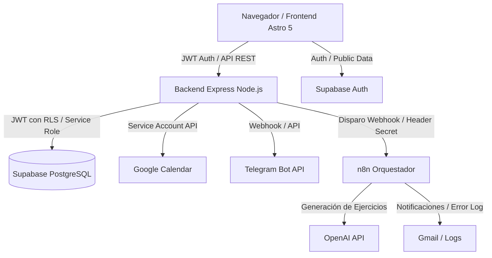
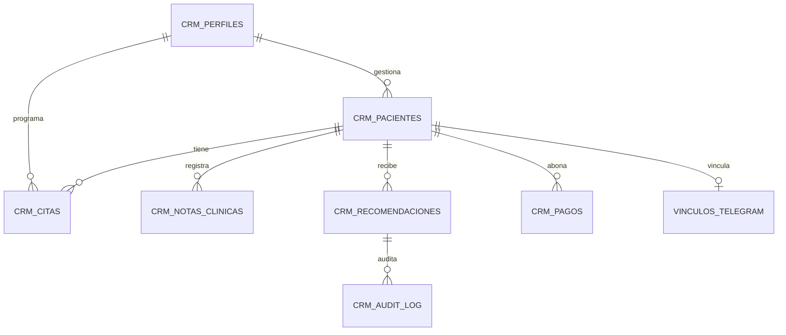

# Architecture

## Overview

## Frontend
- **Framework**: Astro 5 en modo estático (`output: 'static'`) con controladores en cliente y almacenamiento de estado reactivo mediante `nanostores`.
- **Diseño**: Sistema editorial clínico inspirado en *Turn.io* (Refero).
  - Tipografía: `@fontsource-variable/dm-sans` con `font-feature-settings: "ss03" 1`.
  - Tokens: `frontend/src/styles/design-tokens.css` (Canopy Green `#0a3922`, Coral Pulse `#ff643b` reservado a CTAs primarios, paleta de lienzos pastel por contexto).
  - Primitivas y vistas: `editorial-primitives.css`, `editorial-shell.css`, `editorial-views.css`.
- **Estructura de Vistas**:
  - `frontend/src/pages/index.astro`: Punto de entrada del CRM con hidratación de eventos y orquestación de vistas (`data-page`).
  - `frontend/src/components/views/`: Vistas de dominio (`DashboardView`, `CitasView`, `PatientsView`, `FichaPacienteView`, `PagosView`, `IntakesView`, `ConfigView`, etc.).
  - `frontend/src/components/AssistantRail.astro`: Copiloto Clínico contextual (`height: calc(100dvh - 64px)`).

## Backend
- **Framework**: Node.js 20+ con Express en formato ESM.
- **Seguridad y Autorización**:
  - Verificación estricta de JWT de Supabase Auth en `backend/src/middleware/auth.js`.
  - Autorización por rol (`admin` / `fisioterapeuta`) consultando `crm_perfiles` en cada solicitud.
  - Cliente Supabase instanciado por petición utilizando el token del usuario (`supabaseUserClient`), garantizando el aislamiento mediante RLS en base de datos.
  - `service_role` reservado exclusivamente a procesos internos (`cron`, inicialización segura).
  - Rate limiting en endpoints sensibles (`/api/exercises/recommend` a 60 req/h).
- **Trazabilidad (R-2)**:
  - Módulo `backend/src/lib/audit.js` que registra operaciones de creación, edición y supresión en `crm_audit_log` con sanitización de UUID y preservación de contexto en metadatos JSONB.
- **Gating Clínico (R-5)**:
  - Todo plan de ejercicios generado nace en estado `requiere_revision`.
  - Bloqueo estricto de generación de PDF o envío al paciente si la recomendación no está explícitamente `aprobada` por el profesional. Las alertas clínicas (*red flags*) requieren justificación obligatoria.

## Database
- **Motor**: Supabase PostgreSQL 15 con Row Level Security (RLS) activo en todas las tablas `crm_*`.
- **Tablas Principales**:
  - `crm_perfiles`: Vinculación de `auth.users` con datos profesionales y rol.
  - `crm_pacientes`: Directorio de pacientes (soporta soft-delete con `activo = false` y anonimización RGPD).
  - `crm_citas`: Agenda clínica con control de solapamiento y estado de sincronización con Google Calendar.
  - `crm_ejercicios` y `crm_recomendaciones`: Catálogo de ejercicios y planes prescritos.
  - `crm_notas_clinicas`: Historial y evolución de sesiones.
  - `crm_pagos` y `crm_facturas`: Ledger financiero y facturación.
  - `crm_audit_log`: Registro inmutable de auditoría para trazabilidad médica.
  - `vinculos_telegram_pacientes`: Mapeo de chat IDs de Telegram con pacientes.

## AI / Agent
1. **Entrada**: El profesional formula una consulta clínica en el Copiloto Clínico (`AssistantRail`) o solicita generar un plan de ejercicios desde la ficha del paciente.
2. **Procesamiento**: El frontend invoca `/api/exercises/recommend` pasando síntomas, objetivos y contraindicaciones del paciente.
3. **Orquestación**: El backend valida el contrato, verifica rate limit y delega a n8n (`W1_RECOMENDADOR_EJERCICIOS`) o al motor local.
4. **Respuesta y Gating**: El informe se persiste en `crm_recomendaciones` como borrador. El profesional debe validarlo, editar ejercicios y aprobarlo manualmente antes de generar PDF o remitirlo por Telegram/WhatsApp.

## Integrations
- **Google Calendar**: Sincronización bidireccional mediante cuenta de servicio (`google-auth-library`), reflejando eventos, festivos y bloqueos en la vista Agenda.
- **Telegram**: Webhook seguro en `/api/telegram/webhook` con firma de cabecera secreta (`TELEGRAM_WEBHOOK_SECRET`) para comunicación automatizada con pacientes.
- **n8n**: Workflows en `n8n/Fisio_IA_Agent` protegidos con `N8N_WEBHOOK_SECRET` para automatizaciones asíncronas y alertas internas vía Gmail.

## Critical Flows
1. **Autenticación y Perfil**:
   - `Frontend` -> Supabase Auth -> Obtención de JWT.
   - `Frontend` -> `GET /api/me` con `Authorization: Bearer <JWT>` -> Backend valida token y obtiene perfil en `crm_perfiles` -> 200 OK con rol y contexto.
2. **Prescripción y Aprobación Clínica**:
   - `Frontend` -> `POST /api/exercises/recommend` -> Backend valida y crea borrador (`requiere_revision`).
   - `Frontend` -> `PUT /api/exercises/recommendations/:id/approve` -> Profesional firma y aprueba.
   - `Frontend` -> `POST /api/documents/exercise-plan/pdf` -> Permitido únicamente si el plan está en estado `aprobada`.
3. **Supresión RGPD (R-3)**:
   - `DELETE /api/patients/:id`: Soft delete (`activo=false`).
   - `DELETE /api/patients/:id?anonymize=true`: Anonimización irreversible de PII conservando registros clínicos desvinculados por requerimiento legal, con traza en `crm_audit_log`.
