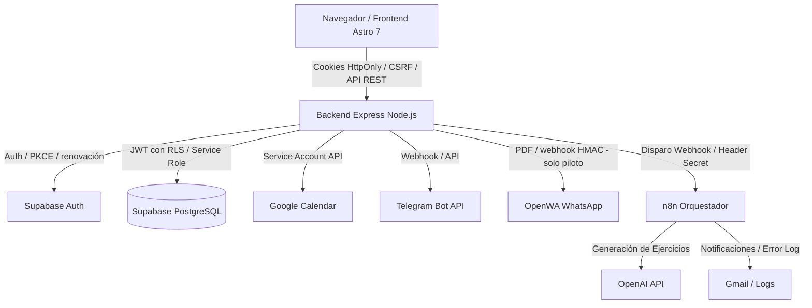
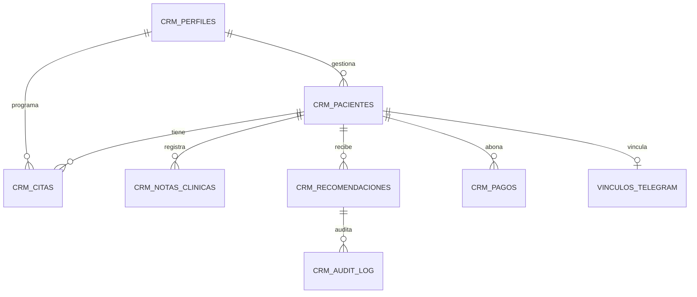

# Architecture

## Estado vigente — 2026-10-08: despliegue y cierre de integraciones

El usuario autorizó fusionar PR #2, aplicar las cinco migraciones ensayadas y configurar/desplegar los servicios existentes. PR #2 fusionado en main (0fce175); frontend/backend desplegados y sanos. Cloud tiene las cinco migraciones, columnas verificadas y RLS preservado. La copia nativa CRM/Auth está restaurada y comprobada; no acredita restauración completa de los internos gestionados.

Se ha ampliado expresamente la preparación para cerrar Calendar, mensajería y cron antes de la primera prueba. Google fue reconectado por el usuario: W5 lee el calendario configurado y W6 lee recursos/páginas completos mediante OAuth. Once workflows existentes actualizados por API: webhooks con Header Auth, llamadas al backend con su clave/secreto, expresiones corregidas y sin reintentos de escritura. Eliminado el atajo del bot que reservaba otra cita cuando fallaba el backend. Exportaciones de producción sin secretos en n8n/Fisio_IA_Agent/production; copias de recuperación con posibles secretos exclusivamente en .env.local.

El backend incorpora comprobación Calendar por OAuth y no acepta una respuesta vacía como calendario vacío. Recordatorios: entrega incierta queda bloqueada, sin reenvío automático; errores SQL no se ocultan. Backend lint/106 pruebas y frontend check/build pasan. Preparación comprobada en local; publicar esta corrección y verificar el nuevo despliegue antes de dar por terminada la primera prueba. El cron Calendar existente sigue cada dos minutos; recordatorios horarios se activarán después de comprobar backend y vista previa.

Pruebas de producción previas: diez controles HTTP/Auth/CSP/proxy pasan; acceso anónimo redirige al login. No acreditan login profesional válido ni entrega real a pacientes. WhatsApp sigue como piloto desactivado; no hay nueva infraestructura. Las entradas siguientes documentan historia: no repetir migraciones, auditorías o despliegues por frases antiguas.

## Overview

Alcance actual: una clínica, reutilizando el CRM y los permisos existentes. El frontend/backend permanecen en el VPS con EasyPanel y la base continúa en Supabase Cloud; no se incorpora administración comercial de varios centros. La separación de credenciales por centro se abordará solo si el usuario decide ampliar el producto.

```mermaid
graph TD
    Client[Navegador / Frontend Astro 7] -->|Cookies HttpOnly / CSRF / API REST| Backend[Backend Express Node.js]
    Backend -->|Auth / PKCE / renovación| SupabaseAuth[Supabase Auth]
    Backend -->|JWT con RLS / Service Role| Postgres[(Supabase PostgreSQL)]
    Backend -->|Service Account API| GCal[Google Calendar]
    Backend -->|Webhook / API| Telegram[Telegram Bot API]
    Backend -->|PDF / webhook HMAC - solo piloto| OpenWA[OpenWA WhatsApp]
    Backend -->|Disparo Webhook / Header Secret| N8N[n8n Orquestador]
    N8N -->|Generación de Ejercicios| OpenAI[OpenAI API]
    N8N -->|Notificaciones / Error Log| InternalAlerts[Gmail / Logs]
```

La sesión del navegador pasa por `/api/auth` en Express. Access/refresh y verifier PKCE solo se guardan en cookies host-only HttpOnly, Lax y Secure/`__Host-` en producción. El navegador recibe el perfil verificado, usa credentials=include y cabecera CSRF; no usa el SDK Auth ni almacena tokens en localStorage. La configuración runtime ya no publica clave Supabase; las guardas de configuración antigua siguen rechazando valores privados. Integraciones conservan Bearer/secreto: no adoptan cookies ni obtienen privilegios por enviar IDs.

Cada petición profesional valida usuario con Auth y perfil/clínica activos mediante cliente JWT con RLS; no hay cliente privilegiado de respaldo. Las cookies requieren origen exacto y cabecera propia incluso en lecturas; GET/HEAD same-origin permiten Origin ausente con Sec-Fetch-Site. `/session` renueva solo tras una denegación de acceso comprobada o ausencia de access cookie, nunca ante fallo/incompletitud del proveedor. La renovación concurrente se comparte en una instancia. Frontend verifica sesión antes de mutar y solo reintenta lecturas: no vuelve a enviar una escritura clínica incierta.

Sesión Auth y respuestas profesionales no se cachean. La duración efectiva/revocación la controla Supabase; las cookies duran como máximo 30 días y no prueban por sí mismas autorización. Recuperación PKCE requiere mismo navegador/último enlace; datos de Auth incompletos fallan cerrados. Contraseñas siguen en Supabase, sin almacén propio. Sitio HTTPS común web/API, proxy/cache, configuración Auth y proveedores reales deben verificarse antes de desplegar; EasyPanel sigue aparcado.

## Frontend
- **Framework**: Astro 7.3.7 en modo estático (`output: 'static'`) con controladores en cliente y almacenamiento mediante `nanostores`; `compressHTML` conserva el comportamiento anterior.
- **CSP**: HTML compilado con política nativa de Astro antes de cargar scripts; hashes de código generado y scripts propios, sin eval/handlers de atributos. Layout y reserva usan controladores JS empaquetados. Configuración runtime síncrona al comienzo del body. Nginx limita conexiones a self y orígenes efectivos backend/Supabase (runtime antes que build), con frame-ancestors/Permissions-Policy por location. Defaults de URLs del build fuera del HTML; entrypoint rechaza configuraciones inseguras antes de publicar. Estilos de atributos/imágenes externas de catálogo conservados; micrófono propio permitido. Contenedor/proxy no acreditados.
- **Diseño**: Precisión azul, DESIGN.md v6; referencias Planhat (estructura) y Ramp (acciones).
  - Tipografía: `@fontsource-variable/dm-sans` con `font-feature-settings: "ss03" 1`.
  - Tokens: `frontend/src/styles/design-tokens.css` (azul `#175dd0` para acción/foco, lienzo `#f4f7fb`, superficies blancas y estados semánticos etiquetados).
  - Shell compartido: `precision-blue.css`; primitivas/vistas existentes y estilos `precision-*.css`. Layout no importa la capa histórica `editorial-shell.css`.
- **Estructura de Vistas**:
  - `frontend/src/pages/index.astro`: Punto de entrada del CRM con hidratación de eventos y orquestación de vistas (`data-page`).
  - `frontend/src/components/views/`: Vistas de dominio (`DashboardView`, `CitasView`, `PatientsView`, `FichaPacienteView`, `PagosView`, `IntakesView`, `ConfigView`, etc.).
  - `frontend/src/components/AssistantRail.astro`: Copiloto Clínico contextual (`height: calc(100dvh - 64px)`).
  - `ConfirmDialog.astro`: consume los eventos compartidos `fisio:open-confirm` / `fisio:close-confirm`, actualiza `modalState` y devuelve la decisión a los consumidores existentes. Escape cancela; Tab queda dentro del diálogo y se restaura el foco al cerrar. La navegación fija móvil reserva espacio en `.content` para no cubrir botones inferiores.

## Backend
- **Framework**: Node.js 20+ con Express en formato ESM.
- **Seguridad y Autorización**:
  - Verificación de sesión de Supabase Auth en `backend/src/middleware/security.js`.
  - Autorización por rol (`admin` / `fisioterapeuta`) y clínica activa consultando `crm_perfiles` y `crm_clinicas` en cada solicitud; sin acceso privilegiado con tokens de demostración.
  - Cliente Supabase instanciado por petición utilizando el token del usuario (`supabaseUserClient`), garantizando el aislamiento mediante RLS en base de datos.
  - `service_role` se usa en procesos internos y reservas públicas. Las reservas resuelven un profesional explícito y limitan la búsqueda/creación de pacientes a su clínica. Las demás integraciones privilegiadas mantienen configuración global para un único centro; verificar sus destinos antes de usarlas. La separación para varios centros queda aplazada; véase `docs/STATUS.md`.
  - IA/audio comparten límite por perfil verificado (60 req/h por defecto). CORS solo usa orígenes HTTPS explícitos en producción. Auth del navegador pasa a cookies HttpOnly/CSRF y deja de publicar claves/tokens; Bearer de integraciones se conserva. Implementación local, límites/verificación real pendientes en `docs/SECURITY_REVIEW_2026-10-08.md`.
- **Trazabilidad (R-2)**:
  - Módulo `backend/src/lib/audit.js` que registra operaciones de creación, edición y supresión en `crm_audit_log` con sanitización de UUID y preservación de contexto en metadatos JSONB.
- **Gating Clínico (R-5)**:
  - Todo plan de ejercicios generado nace en estado `requiere_revision`.
  - `review_exercise_recommendation` verifica sesión/permisos, versión del informe y ejercicios válidos; las alertas requieren una nota de al menos 12 caracteres. Revisión y auditoría son una transacción SQL.
  - Los triggers impiden aprobación directa desde la Data API y cambios/eliminación del contenido o ejercicios aprobados. Seguimiento no cambia estados. PDF y envíos leen `report_snapshot` mediante `approved-exercise-report.js`, con identidad del paciente obtenida del registro.
  - El servidor marca `enviada` tras confirmar el documento en Telegram. La migración clínica ya está aplicada en Cloud; no se enviaron mensajes ni PDF reales y el backend actualizado sigue sin desplegar.

## Database
- **Motor**: Supabase PostgreSQL 17.6 (`ACTIVE_HEALTHY`, plan Free). Endurecimiento y tres migraciones V2 aplicados con autorización, más asignación a Fisioterapia Carla JL. Las 35 tablas públicas tienen RLS; cuenta admin, Auth/PostgREST y conservación de los registros verificados. Vault tiene ejecución exclusiva del servidor; avisos restantes en STATUS. Este diagrama describe el código local: EasyPanel todavía no ejecuta la aplicación V2.
- **Tablas Principales**:
  - `crm_clinicas`: Centro, datos de contacto y estado activo.
  - `crm_perfiles`: Vinculación de `auth.users` con datos profesionales, rol y una clínica.
  - `crm_pacientes`: Directorio con baja lógica (`activo = false`). Alta con UUID de servidor e INSERT sin RETURNING por las políticas de propiedad. Anonimización parcial antigua bloqueada; procedimiento completo pendiente.
  - `crm_citas`: Agenda clínica con control de solapamiento y estado de sincronización con Google Calendar.
  - `crm_ejercicios_catalogo` y `crm_recomendaciones`: Catálogo de ejercicios y planes, con informe persistido (`report_snapshot`) y versión (`report_version`).
  - `crm_notas_clinicas`: Historial y evolución de sesiones.
  - `crm_pagos` y `crm_facturas`: Ledger financiero y facturación. En el código local, cada cobro tiene un único vínculo de factura; emisión/numeración/auditoría son una transacción profesional. Importe cobrado final, con IVA incluido cuando procede y motivo de exención sanitaria en el PDF. Migración `20261007154552_financial_integrity.sql` pendiente de aplicar en Cloud; datos fiscales del emisor y SIF aún pendientes.
  - `crm_bonos`: paquetes con capacidad y fechas; consumo mediante UPDATE atómico sujeto a RLS, estado activo y disponibilidad de sesiones.
  - `crm_audit_log`: Registro inmutable de auditoría para trazabilidad médica.
  - `vinculos_telegram_pacientes`: Mapeo de chat IDs de Telegram con pacientes.

### Aislamiento de clínicas (V2)

La migración `20261007091159_clinic_isolation.sql` requiere el endurecimiento `20260901_production_security_hardening.sql`. Añade `clinica_id` a perfiles, pacientes, asignaciones y profesionales del esquema anterior. La clínica de la sesión procede del perfil almacenado, nunca de metadatos editables del JWT ni del cuerpo de la petición.

Las políticas RLS consultan funciones privadas: administrador dentro de su clínica, fisioterapeuta para pacientes propios o asignados. Las tablas ligadas al paciente heredan ese alcance mediante `can_access_crm_patient`. El catálogo general de ejercicios continúa compartido. Las claves foráneas compuestas impiden asignaciones y propietarios de otra clínica. Los usuarios no pueden editar clínica, rol o vínculo de autenticación.

Los registros antiguos sin clínica quedan preservados y fuera del acceso habitual hasta su mapeo explícito. El alta de centros y la asignación de perfiles son operaciones administrativas del servidor; no se incorpora un panel global en este incremento.

```mermaid
erDiagram
    CRM_PERFILES ||--o{ CRM_PACIENTES : gestiona
    CRM_PERFILES ||--o{ CRM_CITAS : programa
    CRM_PACIENTES ||--o{ CRM_CITAS : tiene
    CRM_PACIENTES ||--o{ CRM_NOTAS_CLINICAS : registra
    CRM_PACIENTES ||--o{ CRM_RECOMENDACIONES : recibe
    CRM_PACIENTES ||--o{ CRM_PAGOS : abona
    CRM_PACIENTES ||--o| VINCULOS_TELEGRAM : vincula
    CRM_RECOMENDACIONES ||--o{ CRM_AUDIT_LOG : audita
```

## AI / Agent

La consulta de trabajos asíncronos vuelve a verificar el paciente con RLS de la sesión incluso cuando el resultado está en caché; no basta con haber autorizado el trabajo al crearlo. Si no tiene paciente, exige el profesional de sesión. Un fallo SQL de lectura se devuelve como fallo, sin asumir ausencia. Los contextos internos privilegiados siguen sujetos al middleware existente.

`public-error.js` sustituye diagnósticos técnicos por mensajes seguros cuando `NODE_ENV=production`; los llamadores afectados conservan estados/códigos y mensajes de negocio controlados. Los códigos PT públicos de las RPC deben mantener mensajes fijos sin valores privados. Esta protección alcanza errores dentro de respuestas exitosas de Calendar/ejercicios; no modifica contenido clínico histórico ni constituye saneamiento de logs.

1. **Entrada**: El profesional formula una consulta clínica en el Copiloto Clínico (`AssistantRail`) o solicita generar un plan de ejercicios desde la ficha del paciente.
2. **Procesamiento**: El frontend invoca `/api/exercises/recommend` pasando síntomas, objetivos y contraindicaciones del paciente.
3. **Orquestación**: El backend valida el contrato, verifica rate limit y delega a n8n (`W1_RECOMENDADOR_EJERCICIOS`) o al motor local.
4. **Respuesta y Gating**: El informe completo se persiste en `crm_recomendaciones.report_snapshot` como borrador. El profesional puede editarlo y debe aprobar su versión actual antes de generar PDF o remitirlo por Telegram o WhatsApp (piloto). El contenido aprobado queda inmutable; una modificación clínica posterior requiere un plan nuevo.

## Integrations
- **Google Calendar**: Sincronización bidireccional mediante cuenta de servicio (`google-auth-library`), reflejando eventos, festivos y bloqueos en la vista Agenda.
  - Las citas CRM se guardan antes de cualquier mutación externa. `calendar_sync_pending` mantiene la operación sin comprobar y protege la fila de nuevos escritores y de reconciliaciones obsoletas; confirmación de Calendar más vínculo confirmado limpian la marca. Un fallo conserva datos/aviso, sin failover ni compensación destructiva.
  - Descripción con ID real CRM y operación; fila con calendario/en curso. Comprobación profesional lee el ID vinculado o todas las páginas por referencia, valida evidencia única/exacta y condiciona vínculo/desbloqueo a la versión. Cancelar requiere tombstone del ID vinculado; ausencia o petición en curso mantienen bloqueo. W5 no acredita esta evidencia; sin replay/limpieza por timeout. Migraciones solo locales.
- **Telegram**: Webhook heredado en `/api/telegram/incoming` con cabecera secreta (`TELEGRAM_WEBHOOK_SECRET`); el piloto usa `/api/telegram/pilot-incoming` y un secreto distinto. No sustituir bots productivos al preparar pruebas.
- **WhatsApp (piloto)**: Conector HTTP OpenWA, webhook `/api/whatsapp/incoming` con HMAC sobre el cuerpo original y sesión fija. Links y entregas protegidos por clínica; solo planes aprobados. OpenWA confirma aceptación de forma síncrona; la entrega se registra por recibo asíncrono. Ver `docs/PILOTO_MENSAJERIA.md`.
- **Reservas del piloto**: `patient-booking.js` comparte diálogo guiado en ambos canales para pacientes registrados. Reutiliza el intérprete de fechas de Telegram y `createCrmAppointment` de `professional.js`; no añade llamadas a modelos. Versiones e idempotencia en `crm_mensajeria_vinculos`/`crm_mensajeria_eventos`, entregas en `crm_whatsapp_envios`. Una clínica por backend hasta separar las demás credenciales.
- **n8n**: Workflows en `n8n/Fisio_IA_Agent` protegidos con `N8N_WEBHOOK_SECRET` para automatizaciones asíncronas y alertas internas vía Gmail.

## Critical Flows
1. **Autenticación y Perfil**:
   - `Frontend` -> `POST /api/auth/login` con credenciales y cabecera CSRF -> Backend obtiene sesión en Supabase, verifica Auth/perfil/clínica y escribe cookies HttpOnly.
   - `Frontend` -> `POST /api/auth/session` con cookies/CSRF -> Backend verifica/renueva sesión y devuelve perfil/rol/clínica sin tokens. Las peticiones profesionales posteriores conservan esta comprobación bajo RLS; `GET /api/me` sigue disponible con cookies o Bearer verificados.
2. **Prescripción y Aprobación Clínica**:
   - `Frontend` -> `POST /api/exercises/recommend` -> Backend valida y crea borrador (`requiere_revision`).
   - `Frontend` -> `POST /api/exercises/recommendations/:id/review` con `decision`, `note` y `report_version` -> RPC SQL verifica y registra la revisión.
   - `Frontend` -> `POST /api/exercises/reports/pdf` o `POST /api/telegram/patient-report/send` -> Permitido para `aprobada`/`enviada` con firma y contenido persistido. El servidor ignora contenido clínico y nombres sustituidos en la petición.
3. **Baja y supresión de identidad pendiente**:
   - `DELETE /api/patients/:id`: Soft delete (`activo=false`).
   - `DELETE /api/patients/:id?anonymize=true`: 409 sin modificar datos; la operación antigua no cubría historial, documentos, comunicaciones ni facturas.
4. **Historial de notas**:
   - Ficha/evolución resumen las últimas 30 notas guardadas con el cliente de sesión/RLS, sin tareas privilegiadas ni llamadas nuevas a IA. Historial completo paginado; no se elimina por el límite del resumen. Edición/borrado se reflejan al consultar.
   - Nota manual, voz, mapa de dolor y borrado comparten recarga. Un fallo de refresco avisa que la escritura ya se confirmó y no debe repetirse.
