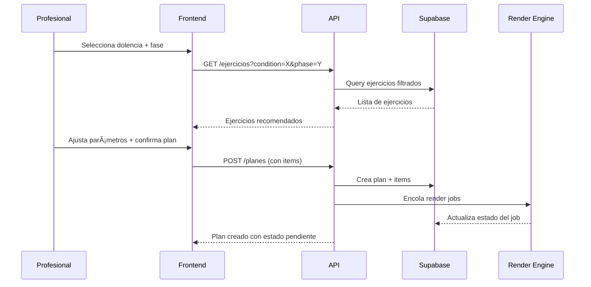

# Arquitectura del Sistema — Fisio_IA_Agent

## Diagrama general

```mermaid
graph TB
    subgraph Frontend["Frontend (Astro)"]
        PP["Portal Profesional"]
        PPT["Portal Paciente"]
        PM["Panel de Métricas"]
    end

    subgraph Backend["Backend (Node.js/Express)"]
        AUTH["Auth & Roles"]
        PRESC["Motor de Prescripción"]
        RENDER["Gestión de Render"]
        API["API REST"]
    end

    subgraph Database["Supabase (PostgreSQL)"]
        DB["Base de datos"]
        STORAGE["Storage (vídeos)"]
        SAUTH["Supabase Auth"]
    end

    subgraph Automation["Automatización"]
        N8N["n8n Workflows"]
    end

    PP --> API
    PPT --> API
    PM --> API
    API --> AUTH
    API --> PRESC
    API --> RENDER
    AUTH --> SAUTH
    PRESC --> DB
    RENDER --> DB
    RENDER --> STORAGE
    N8N --> API
    N8N --> DB
```

## Componentes

### Frontend (Astro)

| Componente | Descripción |
|---|---|
| **Portal Profesional** | Gestión de pacientes, prescripción de ejercicios, generación de vídeos, seguimiento |
| **Portal Paciente** | Acceso a planes, visualización de vídeos, registro de dolor/ejecución |
| **Panel de Métricas** | Dashboard con KPIs, adherencia, evolución, alertas |

### Backend (Node.js/Express)

| Módulo | Responsabilidad |
|---|---|
| **Auth & Roles** | Autenticación vía Supabase Auth, middleware de roles (profesional/paciente/admin) |
| **Motor de Prescripción** | Reglas clínicas configurables, recomendación de ejercicios según dolencia+fase |
| **Gestión de Render** | Cola de jobs de renderizado, estado del render, asociación a planes |
| **API REST** | Endpoints CRUD para todas las entidades del modelo |

### Base de datos (Supabase)

- **PostgreSQL** con RLS (Row Level Security) para aislamiento de datos.
- **Supabase Auth** para gestión de usuarios y sesiones.
- **Supabase Storage** para almacenamiento de vídeos renderizados.

### Automatización (n8n)

- Recordatorios de sesiones pendientes.
- Alertas por baja adherencia.
- Notificaciones de progreso al profesional.
- Webhooks para eventos del sistema.

---

## Flujo de datos — Prescripción de ejercicios

## Flujo de datos — Seguimiento del paciente

```mermaid
sequenceDiagram
    participant PT as Paciente
    participant F as Frontend
    participant A as API
    participant DB as Supabase
    participant N as n8n

    PT->>F: Registra sesión (dolor, notas)
    F->>A: POST /sesiones
    A->>DB: Guarda workout + items
    A->>DB: Recalcula adherencia
    DB-->>A: Métricas actualizadas
    A-->>F: Confirmación
    
    alt Adherencia baja o dolor alto
        A->>N: Webhook de alerta
        N->>N: Genera notificación
    end
```

