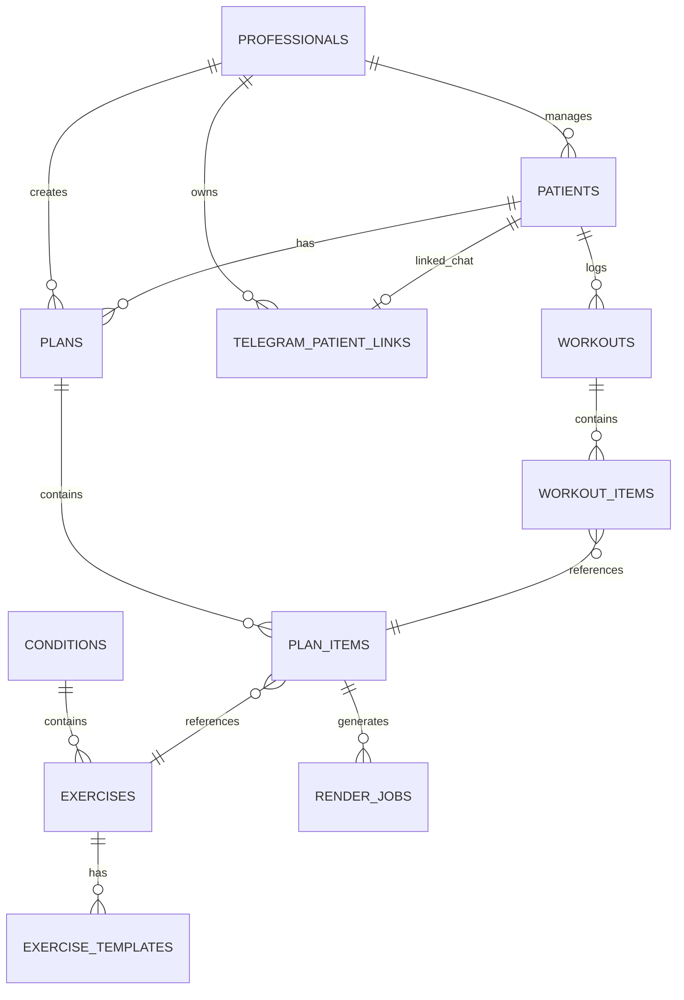

# Modelo de Datos - Fisio_IA_Agent

## Diagrama ER

## Nueva tabla para Telegram

### `vinculos_telegram_pacientes`

Relaciona cada paciente con un chat de Telegram para habilitar chat y comandos desde n8n.

| Campo | Tipo | Descripcion |
|---|---|---|
| `id` | UUID (PK) | Identificador |
| `patient_id` | UUID (FK, unique) | Paciente vinculado |
| `professional_id` | UUID (FK) | Profesional propietario |
| `telegram_chat_id` | TEXT (unique) | Chat ID de Telegram |
| `telegram_username` | TEXT | Username de Telegram |
| `link_code` | TEXT (unique) | Codigo de vinculacion `/start` |
| `linked_at` | TIMESTAMPTZ | Fecha de vinculacion |
| `created_at` | TIMESTAMPTZ | Creacion |
| `updated_at` | TIMESTAMPTZ | Ultima actualizacion |

## Referencia

- Esquema SQL completo: `database/schema.sql`
- Flujo Telegram: `n8n/telegram-bot.md`
